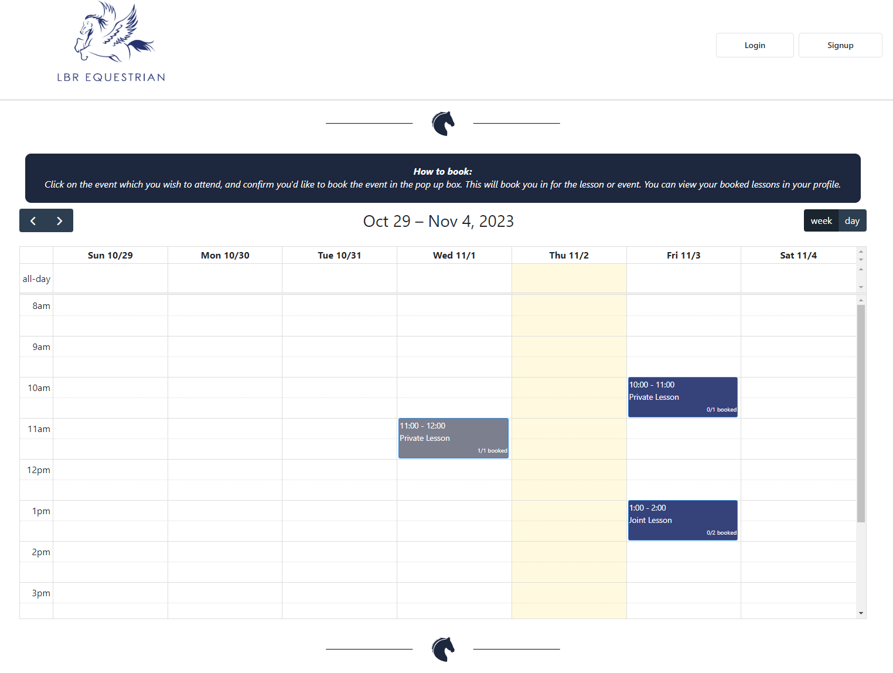
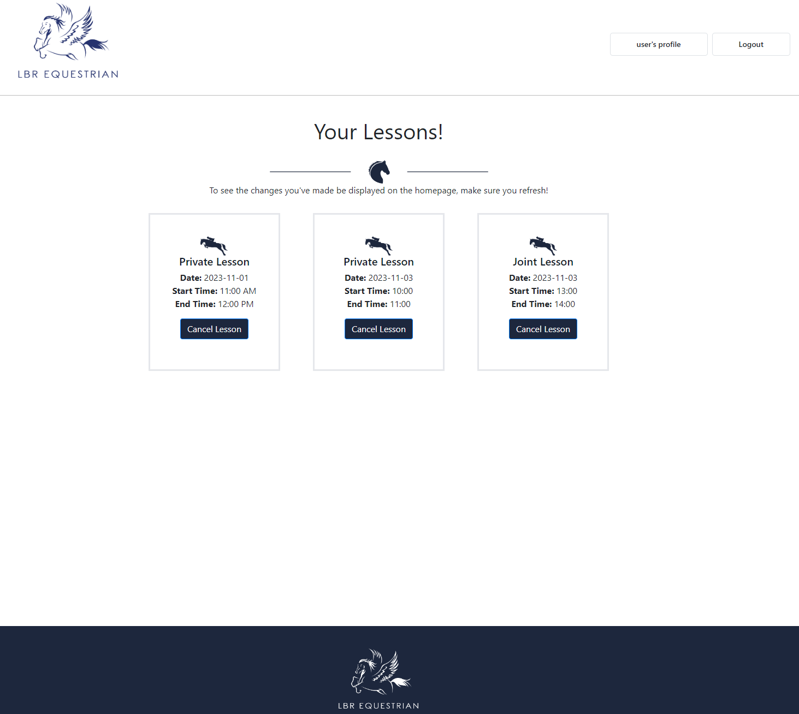
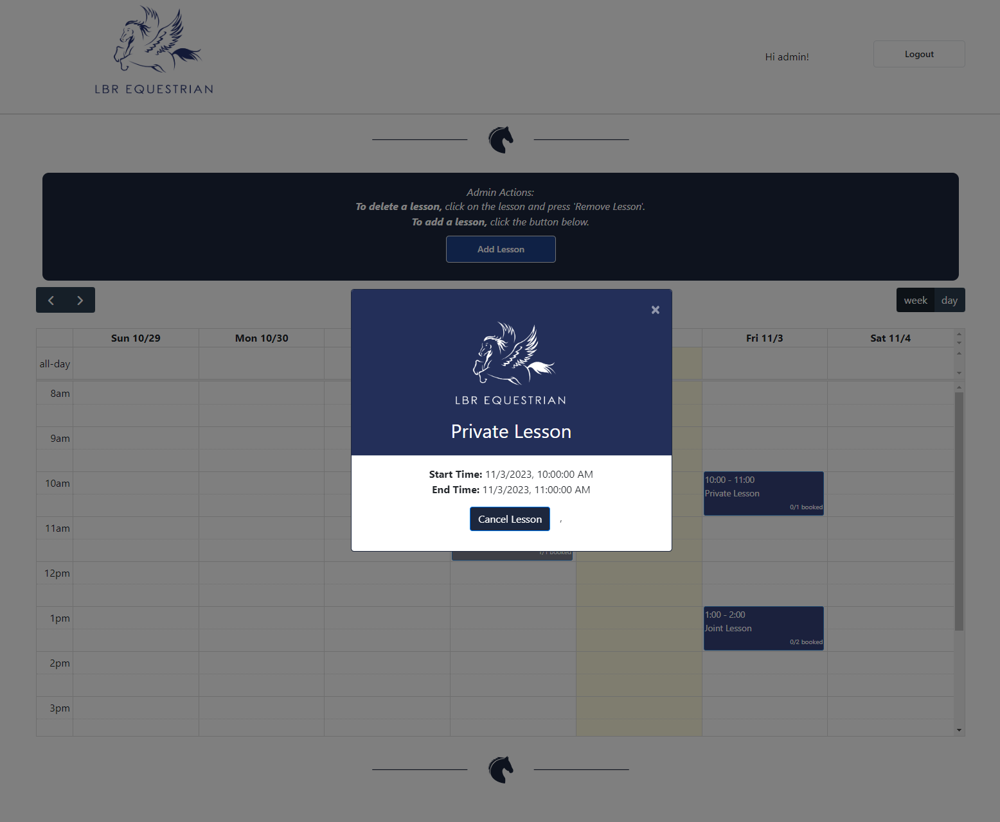
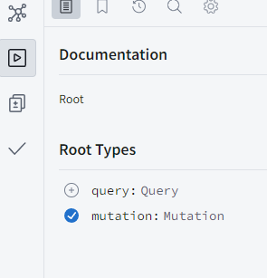
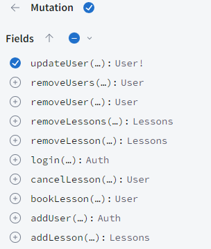
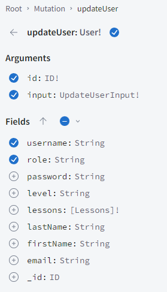
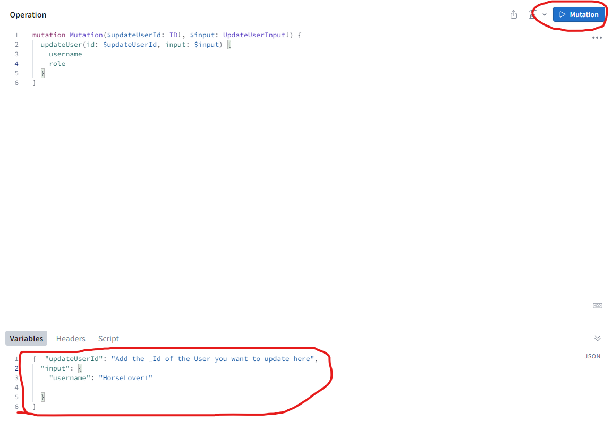
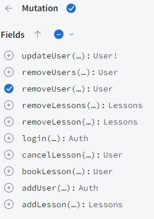
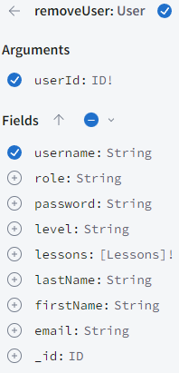
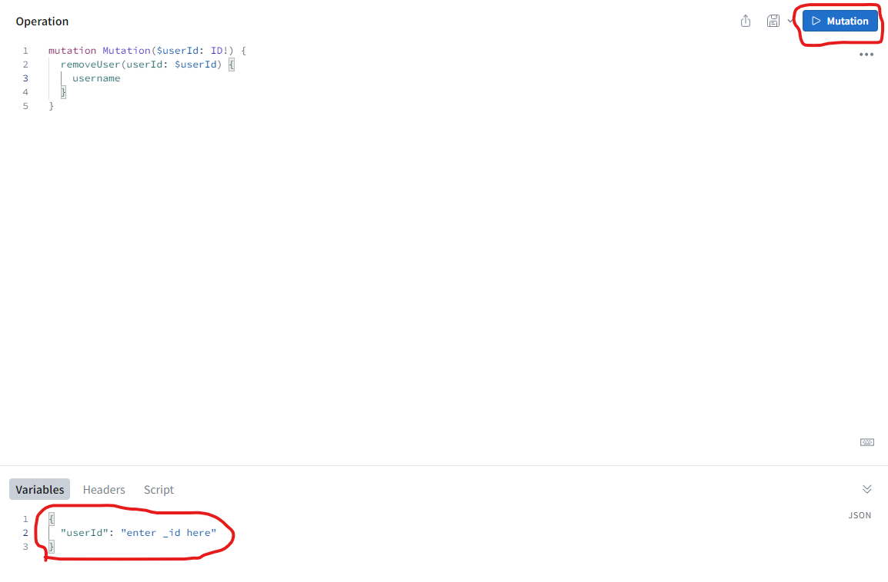

# Equestrian Booking System 

# Table of Contents
- [Description](#description)
- [Installation](#installation)
- [Usage](#usage)
- [License](#license)
- [Tests](#test)
- [Questions](#questions)

## Description:
This application is a booking system designed for LBR equestrian, to serve as an additional site which users can click through to from the main website, in order to be able to book lessons at the riding facility.

The app features an intuitive UI, where users can see the lessons being offered by the business, and can click on a lesson to book it. It also features a profile page, where users can view the lessons they've booked in for and cancel them if necessary. Moreover, lessons on the calendar show how many riders are allowed to book in for that lesson, and will turn grey and become unbookable if the lesson is at full capacity. 

When logged in to an admin account, the homepage changes to display an admin control panel, which describes how admins can delete a lesson (by clicking on a calendar event and pressing 'Remove Lesson') and provides an 'Add lesson' button which allows users to add a lesson via a modal pop up.

 

## Installation:

You can either install this application and run it on your local host (explained below), or you are able to use it via Heroku: https://lbr-equestrian-3915c8ef1e4d.herokuapp.com/

**To install this application and run it on your local host, you will need to:**
- Ensure you have a Terminator emulator Software installed (such as Terminal for Mac, or Bash for Windows). 
- Ensure you have a code editor, such as VSCode.

## Usage:

Whether you are using the application via Heroku or from your local machine, the database will be seeded with two initial accounts which you can use to navigate the site:

- Admin account - email: admin@lbr.com | password: password
- User account - email: user@lbr.com | password: password

The actions you can take are divided below by the status of your login/your account's role:

**If you're not logged in:**
- On the homepage, you can view the calendar & a 'How to Book' instructions panel. If you click on a calendar event (a lesson), the booking modal will pop up and advise you that you must be logged in to book a lesson.
- You can navigate to the sign-up page and create a user account. This action will immediately log you into the new account.
- You can navigate to the login page to log in to an existing account.

**If you're logged in to a user account:**
- On the homepage, you can view the calendar & a 'How to Book' instructions panel. You can click on a lesson and the booking modal will pop up, allowing you to book the lesson, so long as it is not already booked out or it is not already been booked by the user.
- You can navigate to your profile via the button in the navigation bar. Here, you'll be able to see a list of your booked lessons, and cancel your lessons.

**If you're logged in to an admin account:**
- An admin panel will appear on the homepage, replacing the 'How to Book' panel displayed for users. This panel will describe how you can delete a lesson, and will display an 'Add Lesson' button. By clicking this button, a modal will appear and you will be able to fill out the form to add a new lesson to the calendar. You will need to refresh the page to see the new lesson be added.
- You can click on a lesson on the calendar, and a modal will appear with a 'Remove Lesson' button. If this is clicked, the lesson will be deleted from the calendar. If the lesson already has bookings, a warning alert will display in the modal to inform you that the lesson already has bookings, but the 'Remove Button' will still allow you to delete the lesson, if you wish to do so.

### Using the app via Heroku

Navigate to the Heroku link (https://lbr-equestrian-3915c8ef1e4d.herokuapp.com/). 

Once the application is loaded, you will immediately be able to start undertaking the actions outlined above.

### Using the app via locahost:

#### Opening the application for the first time: 

After cloning this code, you will need to navigate to the folder in your chosen terminal application and run these commands:
- npm run install
- npm run build
- npm run start - once this command has fully run, you can end it (ctrl C). This is to ensure the local server is warmed up before the next command.
- npm run develop

**Note: If this was done successfully, you will see an event already seeded into the calendar once you open the browser. If you do not see this, exit the npm run develop command and run it again. Occassionally, the localhost server & the database server won't be ready in the appropriate order, which means the database won't open. Running npm run develop again will resolve this.**

After this, a port will open, and you'll be able to use the application by navigating to the port in your browser. 

Once you've arrived at the application on a browser, you can utilise the application as explained at the start of the Usage section.

#### Opening the application again:

If you've already used the application and have made no changes to the code, you can boot up the servers again just by running:
-npm run develop

Again, if this was done successfully, you will see an event already seeded into the calendar once you open the browser. If you do not see this, exit the npm run develop command and run it again. Occassionally, the localhost server & the database server won't be ready in the appropriate order, which means the database won't open. Running npm run develop again will resolve this. 

#### Update User

There is currently code enabling you to update a user, via Apollo Server. This has not been implemented on the front end yet. 

To do this, follow these instructions:

- Run 'npm run develop' in your terminal, ensuring you are in the root folder of the project.
- Then, navigate to http://localhost:3011/graphql.
- On the left-hand side of the page, check 'mutations': 
- 
- Then, check updateUser:
- 
- Then, select the fields you'd like to be returned (what you'd like to view about the user after the change has been made):
- 
- Then, in the variables section, fill it out as seen the image, with the input: {} containing the variable you'd like to change (e.g input: { "username": "write updated username here"}). Once this is done, you can press the blue button circled at the top to run the mutation:
- 

#### Delete User

There is currently code enabling you to delete a user, via Apollo Server. This has not been implemented on the front end yet.
To do this, follow these instructions:

- Run 'npm run develop' in your terminal, ensuring you are in the root folder of the project.
- Then, navigate to http://localhost:3011/graphql.
- On the left-hand side of the page, check 'mutations': 
- 
- Then, check 'removeUser':
- 
- Then, select the fields you'd like to be returned (what you'd like to view about the user after the change has been made):
- 
- Then, in the variables section, input the _id of the user you want to delete. Once this is done, you can press the blue button circled at the top to run the mutation:

## License:
The license for this project is: No_License.
This project has not been listed under a license.

## Test:
N/A

## Questions
My GitHub username is p-h-davies, and you can view my profile here: https://github.com/p-h-davies/.
 
To get in contact with me, please email me here: philippadavies603@gmail.com.

